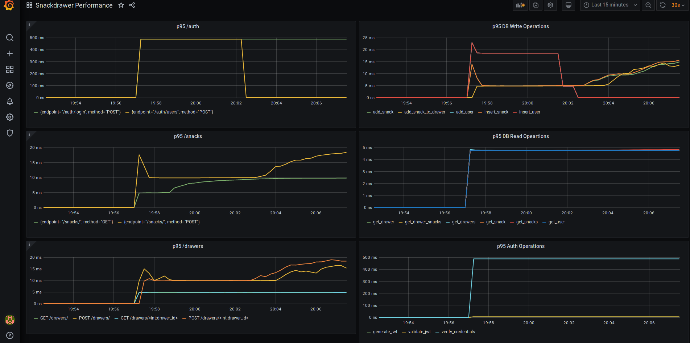
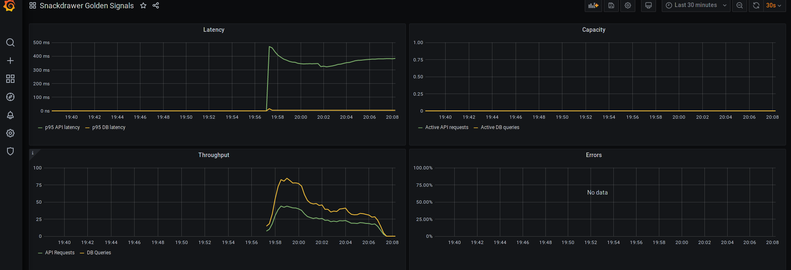

# Snackdrawer

A simple REST API to experiment with observability, metrics gathering and logging tools

## Setting up a Development Environment

This is a Python 3.8 project that uses [pipenv](https://pypi.org/project/pipenv/) for dependency management.

```
pipenv install --dev
```

## Building the API

The Docker image is built using [Buildpacks](https://buildpacks.io/):

```
pack build \
--builder heroku/buildpacks:18 \
snackdrawer
```

When the Docker image is run, it'll be backed by [Gunicorn](https://gunicorn.org/). After the image has been built, a `docker-compose` stack that includes Prometheus and Grafana can be run:

```
docker-compose -f local/docker-compose.yaml up -d
```

The API will be accessible at: `http://localhost:8000`  
Prometheus will be accessible at: `http://localhost:9090`  
Grafana will be accessible at: `http://localhost:3000`

## Running Unit Tests

This project uses [coverage](https://pypi.org/project/coverage/) with the built-in `unittest` library

```
pipenv run coverage run
```

## Load Testing

Once the API is running, it can be load tested using [locust](https://locust.io/). E.g. running a two minute load test that simulates 20 users:

```
pipenv run locust --headless \
-f loadtesting/locust.py \
--only-summary \
-u 20 -r 1 -t 2m --stop-timeout 10 \
-H http://localhost:8000
```

The loadtesting has a single, rudimentary type of user who will:
* Try and get lists of snacks  
* Create a new user account  
* Try and get their list of drawers  
* Try and create new drawers  
* Try and put snacks into their drawers  

If the user gets a `HTTP 401` they'll try and create a new JWT and attempt the task again. Once loadtesting is complete you'll see output showing the statistics of the test.

## Instrumentation

The API is instrumented with Prometheus and Honeycomb. Passing a valid Honeycomb API key as an environment variable will enable tracing and send it to your account.

### Prometheus Metrics

Prometheus metrics are exported on `/metrics`.  The main metrics are:  
* A histogram for all API requests with labels for endpoint and HTTP method  
* A gauge for all active API requests  
* A histogram for all DB query response times with labels for the type of query  
* A gauge for all active DB queries
* A histogram for auth operations (like generating and validating a JWT)  
* A counter for HTTP errors  

### Grafana Dashboards

Two Grafana dashboards are provisioned automatically when the docker-compose stack is used:  
1. p95 statistics for all of the histograms  
2. Google SRE Golden Signals  




### Honeycomb Instrumentation  

Honeycomb's Python Beeline is used to automatically instrument most of the app. This covers the HTTP requests and DB queries. Additional instrumention is done by creating spans.  

## Wishlist

If I get the basic bits working, I'd like to add:
* better Honeycomb instrumentation  
* fault injection with a lazy mode
* different sorts of users (E.g. poorly behaved users who try and access other users' data, script kiddies, etc.)  